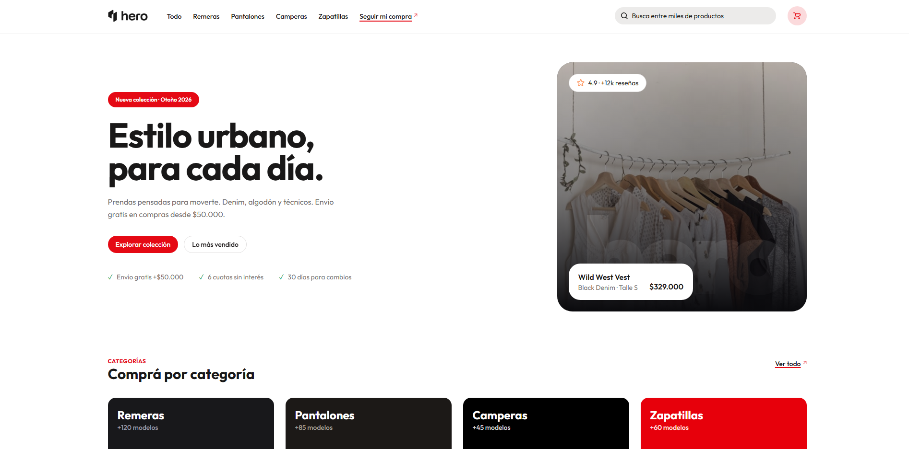
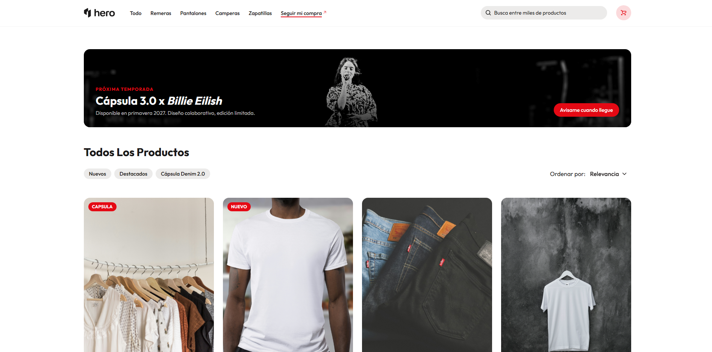
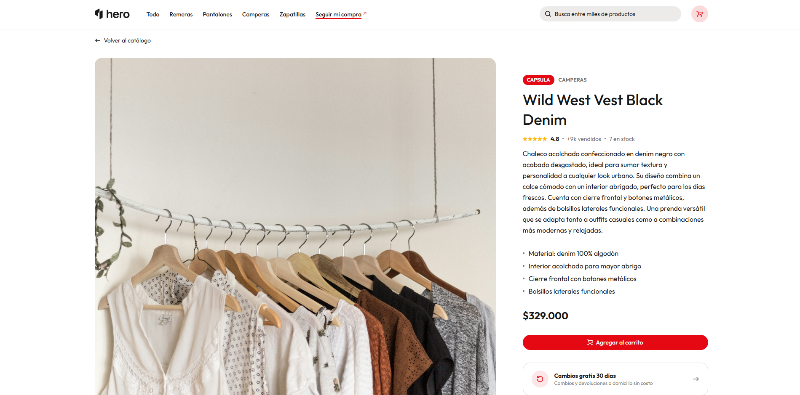

# Hero — Tienda Online

Trabajo Práctico de Construcción de Interfaces de Usuario · UNAHUR 2026

Hero es una tienda de indumentaria urbana construida en React. Permite explorar un catálogo de productos, consultarlos
en detalle, armar un carrito de compras y simular una compra completa con seguimiento de pedido.

## Demo

🔗 [hero-store.vercel.app](https://hero-store.vercel.app)

## Capturas de pantalla

| Inicio                 | Catálogo               | Detalle                    |
|------------------------|------------------------|----------------------------|
|  |  |  |

## Estructura del repositorio

```
tp-interfaces-supercalifragilisticoespialidoso/
├── client/          # Aplicación React (frontend)
└── server/          # Mock REST API con json-server (backend)
```

## Requisitos previos

- Node.js 18+
- npm 9+

## Instalación y ejecución

```bash
# 1. Clonar el repositorio
git clone https://github.com/thomasbarenghi/tp-interfaces-supercalifragilisticoespialidoso.git
cd tp-interfaces-supercalifragilisticoespialidoso

# 2. Instalar y levantar el servidor (terminal 1)
cd server
npm install
npm run dev        # corre en http://localhost:3008

# 3. Instalar y levantar el cliente (terminal 2)
cd ../client
npm install
npm run dev        # corre en http://localhost:5173
```

> Por defecto el cliente apunta al servidor en `localhost:3008`. Para cambiar la URL de la API, crear un archivo `.env`
> en `client/` con `VITE_API_URL=<url>`.

## Tecnologías

| Capa          | Tecnologías                |
|---------------|----------------------------|
| Frontend      | React 19, TypeScript, Vite |
| Estilos       | Tailwind CSS v4, HeroUI    |
| Routing       | React Router v7            |
| Data fetching | SWR                        |
| Backend       | json-server 0.17           |
| Deploy        | Vercel                     |

## Funcionalidades implementadas

- Catálogo con 15 productos, filtros y ordenamiento
- Búsqueda por nombre y filtro por categoría
- Detalle de producto con galería de imágenes
- Carrito persistido en `localStorage`
- Checkout con validaciones y confirmación de compra
- Seguimiento de pedido
- Modo claro / oscuro
- Diseño responsive (mobile, tablet, desktop)

## Integrantes

| Nombre                | GitHub                                               |
|-----------------------|------------------------------------------------------|
| Thomas Barenghi       | [@thomasbarenghi](https://github.com/thomasbarenghi) |
| <!-- integrante 2 --> |                                                      |
| <!-- integrante 3 --> |                                                      |
| <!-- integrante 4 --> |                                                      |
